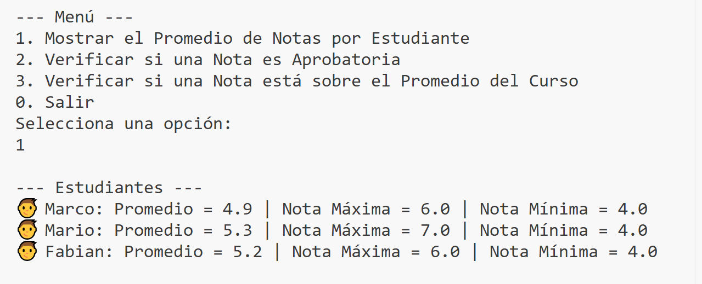
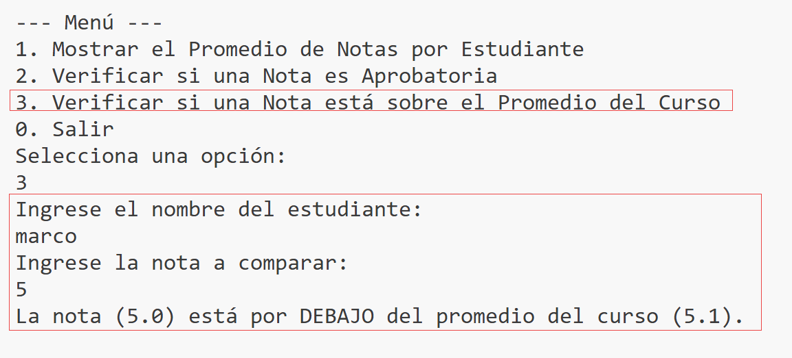

## Solución

Mi solución está estructurada en clases separadas que organizan la __entrada de datos__, las __validaciones__, __el menú__ y las __operaciones__ de cálculo como promedios, notas máximas y mínimas, y comparación con el rendimiento del curso. 

### Estructura:

```bash
├── LibretaDeNotas.java # Clase principal: inicia el flujo del programa.
├── Menu.java # Contiene el menú de interacción con el usuario.
├── OperacionesNotas.java # Lógica de evaluación de notas y estadísticas.
├── Validador.java # Validaciones reutilizables para entrada de datos.
```

> [!NOTE]
> Esta arquitectura modular mejora la legibilidad, reutilización y mantenimiento del código.

### Screenshots:

__Mostrando promedios__:



__Mostrar si la Nota es Aprobatoria__


__Mostrar si la Nota está por Sobre o por Debajo del Promedio__



[](https://classroom.github.com/a/66iuR6Ti)
### **Instrucciones para el Ejercicio "EvaluadorDeClases":**

1. **Crear la clase:**
    - Crea la clase **`LibretaDeNotas`** para que pueda evaluar y almacenar las calificaciones de una lista de estudiantes.
    - Utiliza un **`HashMap`** para almacenar las calificaciones de los estudiantes, donde la llave es el nombre del estudiante y el valor es un **`ArrayList`** de notas.
    - Solicita al usuario que ingrese la cantidad de alumnos y la cantidad de notas por alumno.
    - Solicita el nombre de cada alumno y las notas correspondientes, almacenándolas en el **`HashMap`**.
2. **Recorrer el HashMap y Evaluar Calificaciones:**
    - Utiliza un bucle (por ejemplo, **`for`** o **`foreach`**) para recorrer el **`HashMap`** de calificaciones.
3. **Calcular Promedio, Nota Máxima y Mínima por Estudiante:**
    - Después de evaluar las calificaciones, calcula y muestra para cada estudiante:
        - **Promedio de Notas:** Suma todas las calificaciones y divide por la cantidad total de notas.
        - **Nota Máxima:** Encuentra la calificación más alta en el **`ArrayList`**.
        - **Nota Mínima:** Encuentra la calificación más baja en el **`ArrayList`**.
4. **Menú de Opciones:**
    - Muestra un menú con las siguientes opciones:
        - **1. Mostrar el Promedio de Notas por Estudiante.**
        - **2. Mostrar si la Nota es Aprobatoria o Reprobatoria por Estudiante.**
        - **3. Mostrar si la Nota está por Sobre o por Debajo del Promedio del Curso por Estudiante.**
        - **0. Salir del Menú.**
    - Utiliza un bucle para permitir al usuario seleccionar opciones hasta que ingrese 0 para salir.
5. **Operaciones del Menú:**
    - **Opción 1: Mostrar el Promedio de Notas por Estudiante.**
        - Muestra el promedio de notas por cada estudiante calculado previamente.
    - **Opción 2: Mostrar si la Nota es Aprobatoria o Reprobatoria por Estudiante.**
        - Solicita al usuario ingresar el nombre de un estudiante y una nota, luego verifica si es aprobatoria o reprobatoria según una nota de aprobación definida.
    - **Opción 3: Mostrar si la Nota está por Sobre o por Debajo del Promedio del Curso por Estudiante.**
        - Solicita al usuario ingresar el nombre de un estudiante y una nota, luego verifica si está por sobre o por debajo del promedio general.
6. **Validaciones:**
    - Implementa validaciones para asegurar que las notas ingresadas estén en un rango válido y que la cantidad de alumnos sea un número positivo.
